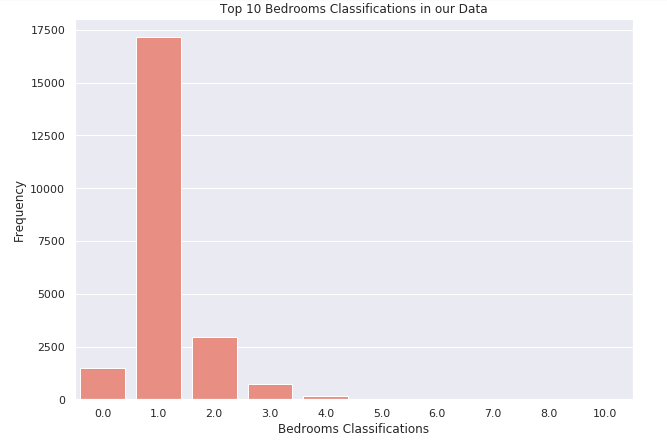
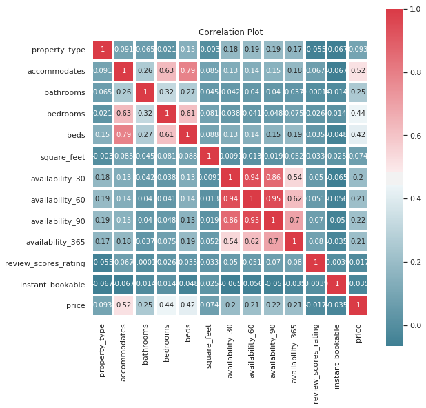

# Airbnb Berlin Price Prediction

__Airbnb has successfully disrupted the traditional hospitality industry as more and more travelers decide to use Airbnb as their primary accommodation provider. Since its inception in 2008, Airbnb has seen an enormous growth, with the number of rentals listed on its website growing exponentially each year.__

* We try to predictthe price of the new accommodation based on certain features such as, __type of prperty, number of bedrooms__,etc.

As a data-analyst we will try to predict the price for a new accommodation on the basis of several features. For our analysis, we selected the following 13 columns out of 97 given columns consisting of 22552 rows:

* Property_type
* Accommodates
* Bathrooms
* Bedrooms
* Beds
* Square_feet
* Availability_30
* Availability_60
* Availability_90
* Availability_365
* Review_scores_rating 
* Instant_bookable
* Price

___

__Exploratory Data Analysis__

  

  

  

  

  

  

  

__Correlation Matrix__

  

__General Trend:__

  

___

__Model Implementaion:__ 

  

__Model Evaluation:__ Root Mean Square Error is quite low hence the model is working well.

* RMSE for training set is 17.75072739660046
* RMSE for test set is 53.744425457842276

___

__Sentiment Analysis:__ By analysing the sentiments of 401963 people reviews, we can say that their majority of customers are satisfied with the service of Airbnb Host in Berlin.

Out of 401963 reviews:
* <75% are Positive.
* 21% are Neutral.
* 2% are Negative.

  

___
