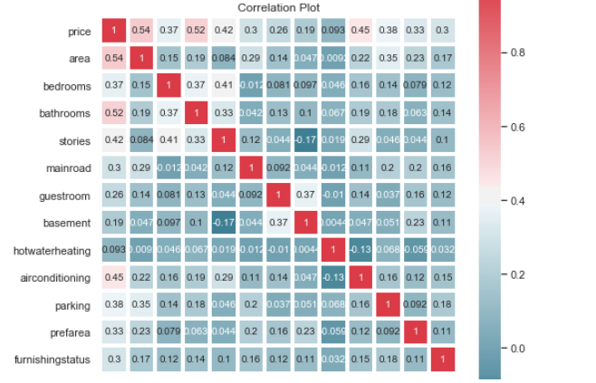

# House Price Prediction

__Price of House__  as a __function__ of __Area ,Airconditioning, Bedrooms, Bathrooms, Stories, Mainroad, Guestroom, Basement, Hotwaterheating, Airconditioning, Parking, Prefarea and Furnishingstatus__. Suppose that in our role as __Data Scientist__ we are asked to suggest.

- We want to find a function that given input Price of House for Area, Bedroom, Bathroom and Airconditioning.

- Visualize the __relationship__ between the _features_ and the _response_ using scatter plots and line plot.

What are the **features**?

- Price            :   Price of House
- Area             :   Area of that particular House
- Bedroom          :   No. of Bedrooms in that House
- Stories          :   No. of Stories
- Mainroad         :   Location of Mainroad (Yes or No)
- Guestrom         :   Availability of Guestroom (Yes or No)
- Basement         :   Availability of Basement (Yes or No)
- Hotwaterheating  :   Availability of Hotwaterheating (Yes or No)
- Airconditioning  :   Availability of Airconditioning (Yes or No)
- Parking          :   No. of the parkings available
- Prefarea         :   Prefered Location (Yes or No)
- Furnishingstatus :   Furnishing status

What is the **response**?

- Price:              Price of the given House
___

Heat-Map showing correlation between all the provided features:-

  

Selecting major features form the heatmap like, __'area','bedrooms', "stories",'airconditioning'.__ 

After fitting simple multiple regression line, coefficients are as follows:
__area = 0.41 (X1)__

__bedrooms = 0.22 (X2)__

__stories = 0.30 (X3)__

__airconditioning = 0.46 (X4)__

__intercept = -1.35 (c)__
___
Final regression line is as follows: Price = 0.41X1 + 0.22X2 + 0.30X3 + 0.46X4 - 1.35.
