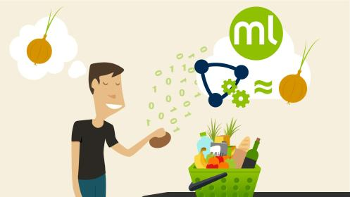

# Market Basket Analysis
  

## Indroduction
Market Basket Analysis is a modelling technique based upon the theory that if you buy a certain group of items, you are more (or less) likely to buy another group of items. For example, if you are in an English pub and you buy a pint of beer and don't buy a bar meal, you are more likely to buy crisps at the same time than somebody who didn't buy beer.

__Who is your Customer?__

Sometime it is not very obvious or short to answer this. There are lots of ways to classify customers and divided them by groups. But since we have data, let's use data approach to answer this question.

When you have data -- like a list of customers and what they bought -- and you need to create groups with similar characterestics using this data, we need a clustering approach.

* Clustering is part of the unsupervised machine learning techniques.
* It is unsupervised as the mahine has no previous information about how it should group the entities.
* They try to create clusters with similar entities by analysinf how close they are one from another.

___

__Basic Exploratory Data Analysis__
  
  
  
  
  

___
__Each customer is scored based on three factors, namely Age, Average-Income and Spending-Score.__

* __Age:__ Customers are divided into different age groups as quality of purchase varries for different age groups.

* __Average-Income:__ Average monthly income of the customers. 
Customers who have higher income are more likely to purchase.

* __Spending-Score:__ The amount of money these customers have spent on purchases.
Customers who have spent higher are more likely to purchase based in the offer compared to those who have spent less.

___
__Segmentation using Age and Spending Score__
  

__Segmentation using Annual Income and Spending Score__
  

__Segmentation using Age , Annual Income and Spending Score__
  
___

