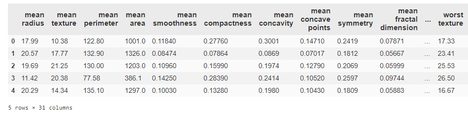
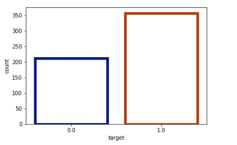
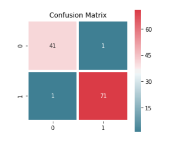
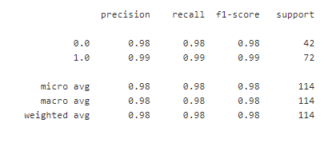

# Breast Cancer Prediction using Support Vector Machine.

__Introduction__

A __Support Vector Machine (SVM)__ is a discriminative classifier formally defined by a separating hyperplane. In other words, given labeled training data (supervised learning), the algorithm outputs an optimal hyperplane which categorizes new examples. In two dimentional space this hyperplane is a line dividing a plane in two parts where in each class lay in either side.
  
It fairly separates the two classes(i.e. patients with and without Cancer). Any point that is left of line falls into Non-Cancer class and on right falls into Cancer class. Separation of classes. That’s what SVM does. It finds out a line/ hyper-plane (in multidimensional space that separate outs classes).
___

__DATA__
  
* The dataset contains patient records maintained by a Hospital.
* We have 200 Non-Cancer patients out of 569 patients.
  
* Dataset is imbalanced, with the positive(Non-Cancer) calss  accounting for 0.352% of all patients.

There are many ways of dealing with imbalanced data. We will focus here on "UnderSampling" process.
For the model analysis we have used SVM to train and test the model.
  

  
