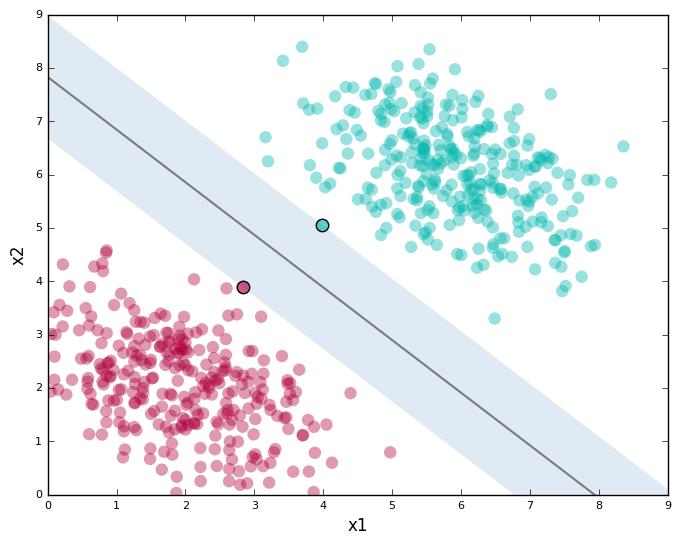

# Cancer Patient Prediction using Support Vector Machine.

__Introduction__

A Support Vector Machine (SVM) is a discriminative classifier formally defined by a separating hyperplane. In other words, given labeled training data (supervised learning), the algorithm outputs an optimal hyperplane which categorizes new examples. In two dimentional space this hyperplane is a line dividing a plane in two parts where in each class lay in either side.
  
It fairly separates the two classes(i.e. patients with and without Cancer). Any point that is left of line falls into Non-Cancer class and on right falls into Cancer class. Separation of classes. That’s what SVM does. It finds out a line/ hyper-plane (in multidimensional space that separate outs classes).

  
