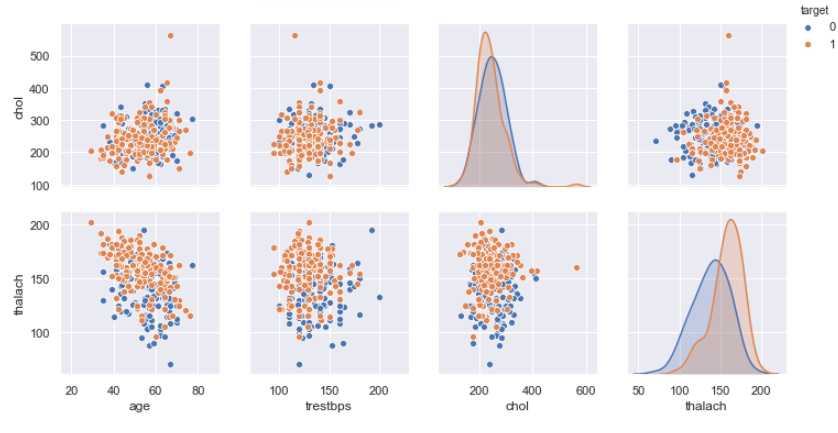
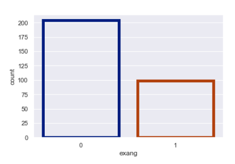
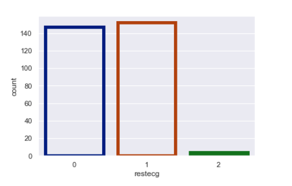

# Heart Patient Prediction using NAIVE-BAYES classifier

__Intoduction__

  
Naive Bayes is a classification algorithm for binary (two-class) and multi-class classification problems. The technique is easiest to understand when described using binary or categorical input values.

It is called naive Bayes or idiot Bayes because the calculation of the probabilities for each hypothesis are simplified to make their calculation tractable. Rather than attempting to calculate the values of each attribute value P(d1, d2, d3|h), they are assumed to be conditionally independent given the target value and calculated as P(d1|h) * P(d2|H) and so on.

This is a very strong assumption that is most unlikely in real data, i.e. that the attributes do not interact. Nevertheless, the approach performs surprisingly well on data where this assumption does not hold.

  

__Basic EDA__

  
  
  
  
  
  
  
  
  
  
  
  
__Heart Disease prediction Report__

  
  
In this case we are gonna try to minimize the number of errors in our prediction results. Errors are on the anti-diagonal of the confusion matrix. But we can infer that being wrong about an actual patient is far worse than being wrong about a healthy patient.

__Accuracy = 79.10%.__

__Misclassification Cost of the above model is 969.__
