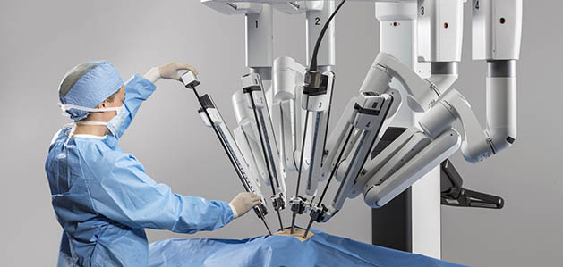

# MEDICAL APPLICATIONS POWERED BY MACHINE LEARNING

  
* __Diagnosis/disease identification:__
Medical care begins with an accurate diagnosis. Machine learning is already at the forefront, assisting leading research organizations in devising better methods of disease identification. Back in 2016, IBM Watson Genomics, a partnership between IBM Watson Health and Quest Diagnostics, began with a view to integrate cognitive computing and genomic tumor sequencing, to make rapid leaps in precision medicine.

  
* __Image analysis for remote diagnosis:__
Extended beyond diagnosis is image analysis, another promising application of ML in the field of medicine and health care. Traditional image analysis (X-rays, MRI scans, CAT scans) is time-consuming. 

  
* __AI-powered robots assisting surgical operations:__
Imagine a robot conducting a complex eye operation. Imagine a mini-robot that enters a heart patient’s chest and assists in mapping and therapy. You don’t really need to imagine, because these are realities. Da Vinci — the most advanced robot for surgical operations, and Heartlander — which does exactly what its name suggests, are in action, performing and assisting in complex eye and heart surgeries, respectively.

  
* __Virtual nursing:__
Yes, there is such a thing as virtual nursing. Not only can machine language-powered nursing chatbots and robots interact with patients more regularly than human nurses, but also can serve as intelligent gatekeepers of information between patients and doctors.
