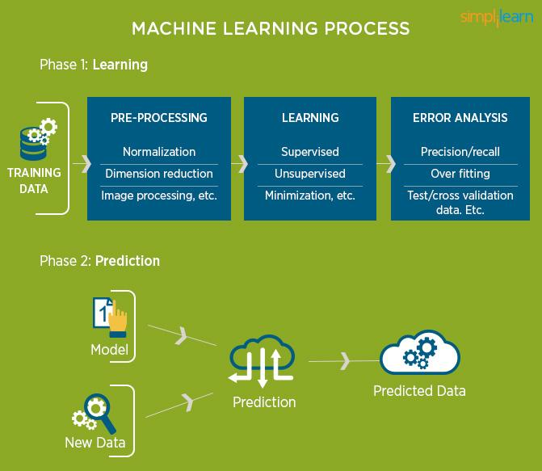

# Machine Learning Using Python
  
Machine learning is a core sub-area of __artificial intelligence__; it enables computers to get into a mode of self-learning without 
being explicitly programmed. When exposed to new data, these computer programs are enabled to learn, grow, change, and develop
by themselves. 

__"Machine learning is a method of data analysis that automates analytical model building."__ In other words, it allows computers to find insightful information without being programmed where to look for a particular piece of information; instead, it does this by using algorithms that iteratively learn from data. 

__Why Machine Learning?__ 
To better understand the uses of machine learning, consider some of the instances where machine learning is applied: house price prediction, student's marks analysis, Heart and Cancer prediction , Customer Segmentation are some examples of applied machine learning. 
All these examples echo the vital role machine learning has begun to take in today’s data-rich world. Machines can aid in filtering useful pieces of information that help in major advancements, and we are already seeing how this technology is being implemented in a wide variety of industries.
  
