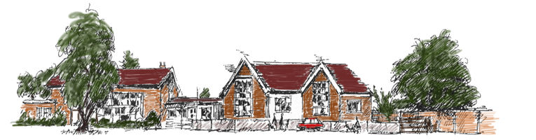

# Machine Learning Using Python
  
Machine learning is a core sub-area of __artificial intelligence__; it enables computers to get into a mode of self-learning without 
being explicitly programmed. When exposed to new data, these computer programs are enabled to learn, grow, change, and develop
by themselves. 

__"Machine learning is a method of data analysis that automates analytical model building."__ In other words, it allows computers to find insightful information without being programmed where to look for a particular piece of information; instead, it does this by using algorithms that iteratively learn from data. 

__Why Machine Learning?__ 
To better understand the uses of machine learning, consider some of the instances where machine learning is applied: house price prediction, student's marks analysis, Heart and Cancer prediction , Customer Segmentation are some examples of applied machine learning and we are already seeing how this technology is being implemented in a wide variety of industries. 
  

## Repository Overview
This repository is about different Machine Learning algorithm approaches as per the industry practices.

## Table of Contents
- [House Price Prediction](#section1) 
- [Market Basket Analysis](#section2) 
- [Student's Marks Analysis](#section3) 
- [Prediction of Lifetime Risk for Heart Disease and Cancer](#section4) 
- [Wine Classification](#section5) 

___

### [House Price Prediction](./House Price Prediction)
  
Price of House as a function of Area ,Airconditioning, Bedrooms, Bathrooms, Stories, Mainroad, Guestroom, Basement, Hotwaterheating, Airconditioning, Parking, Prefarea and Furnishingstatus. Suppose that in our role as Data Scientist we are asked to suggest.
  * We want to find a function that given input Price of House for Area, Bedroom, Bathroom and Airconditioning.
  * Visualize the relationship between the features and the response using scatter plots and line plot.
  * [Link for the Jupyter notebook](./House Price Prediction/House Price analysis.ipynb)

___

### [Market Basket Analysis](./Market Basket Analysis)
  
You are owing a supermarket mall and through membership cards , you have some basic data about your customers like 
Customer ID, age, gender, annual income and spending score.
 * Spending Score is something you assign to the customer based on your defined parameters like customer behavior and purchasing data.
 * [Link for the Jupyter notebook](./Market Basket Analysis/Analysis.ipynb)
 
___ 

### [Student's Marks Analysis](./Student's Marks Analysis)
  
To understand the influence of various factors like economic, personal and social on the students performance.
Inferences would be :
* How to imporve the students performance in each test ?
* What are the major factors influencing the test scores ?
* Effectiveness of test preparation course?
* [Link for the Jupyter notebook](./students-performance-in-exams/Marks predictions.ipynb)

___

### [Prediction of Lifetime Risk for Heart Disease and Cancer](./Prediction of Lifetime Risk for Heart Disease and Cancer)
  
Of all the applications of machine-learning, diagnosing any serious disease using a black box is always going to be a hard sell. If the output from a model is the particular course of treatment (potentially with side-effects), or surgery, or the absence of treatment, people are going to want to know why.
 * [Link for the Jupyter notebook](./Prediction of Lifetime Risk for Heart Disease and Cancer)

___

### [Wine Classification](Wine Classification)
  
Wine classification on the basis of different factors like, Alcohol, Malic Acid, Ash, Ash Alcanity etc. Using Pricipal Component Analysis (PCA) for dimension reduction and then classifying wine into different classes using Nearest Neighbour (KNN) method.
 * [Link for the Jupyter notebook](./Wine Classification/Wine-Classification.ipynb) 
___
