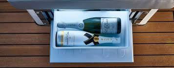
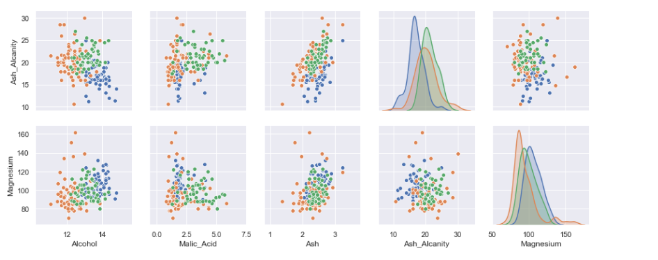
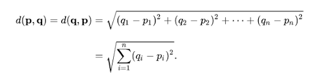
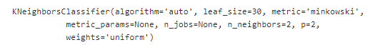
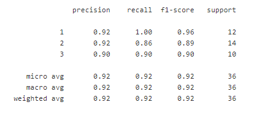
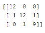

# Wine Classification

  

__Introduction__ 

_Dimension Reduction using PCA:_ __Principal component analysis (PCA)__ is a statistical procedure that uses an orthogonal transformation to convert a set of observations of possibly correlated variables (entities each of which takes on various numerical values) into a set of values of linearly uncorrelated variables called principal components.

  

__When should I use PCA?__
* Do you want to reduce the number of variables, but aren’t able to identify variables to completely remove from consideration?
* Do you want to ensure your variables are independent of one another?
* Are you comfortable making your independent variables less interpretable?

___

__DATA:__ Our data have 14 features.

  

After splitting into X_train and Y_train, X_train can be represented by 10 features instead of orignal 13 features.

  
  
  
  

___

__Classifying Wine using Nearest Neighbour Classifier__

__KNN (K — Nearest Neighbors)__ is one of many (supervised learning) algorithms used in data mining and machine learning, it’s a classifier algorithm where the learning is based “how similar” is a data (a vector) from other. 
_Calculating distance:_
To calculate the distance between two points (your new sample and all the data you have in your dataset) is very simple, as said before, there are several ways to get this value, in this article we will use the Euclidean distance.

The Euclidean distance’s formule is like the image below:
  

__KNN Classification Report__

  
  

__Confusion Matrix__

  

__Misclassification error rate: 0.083__

