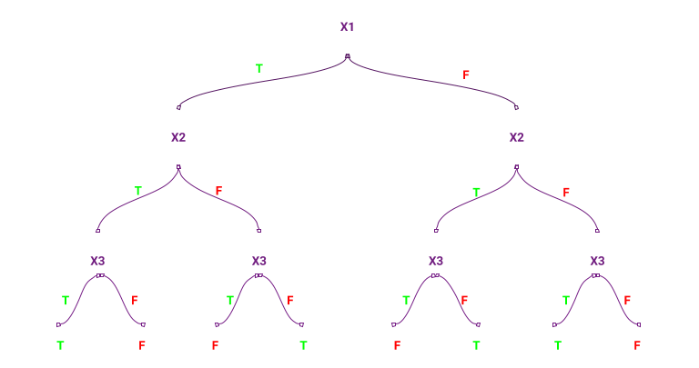
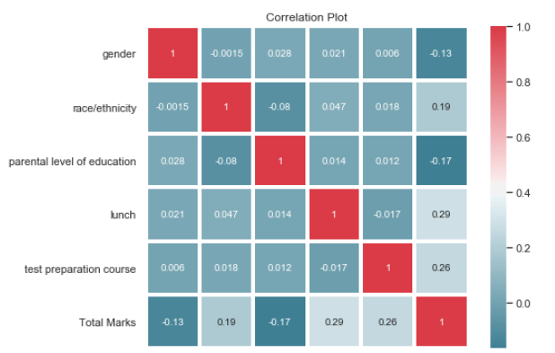
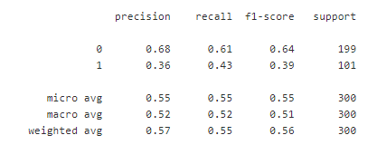
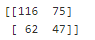
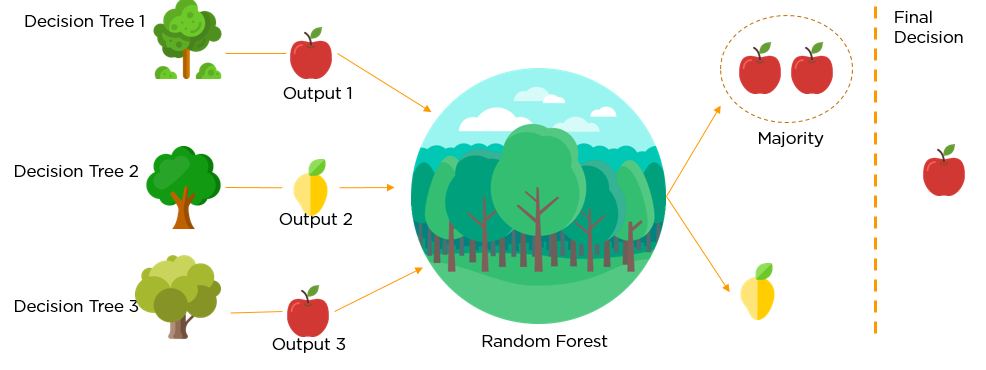
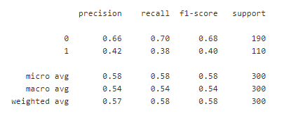
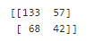
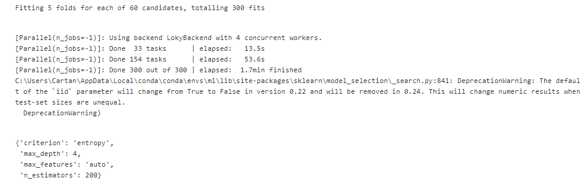

# Students Performance Analysis using Desision Tree and Random Forest Classifier

__Goal:__ To classify student's performance on the basis of completion of preparation course.

__Introduction:__

A __Decision Tree__ is a decision support tool that uses a tree-like graph or model of decisions and their possible consequences, including chance event outcomes, resource cost, and utility. It is one way to display an algorithm that only contains conditional control statements.

  

They are adaptable at solving any kind of problem at hand (classification or regression). Decision Tree algorithms are referred to as __CART (Classification and Regression Trees)__.

__“The possible solutions to a given problem emerge as the leaves of a tree, each node representing a point of deliberation and decision.”__

Common terms used with Decision trees:

__Root Node__: It represents entire population or sample and this further gets divided into two or more homogeneous sets.
__Splitting__: It is a process of dividing a node into two or more sub-nodes.
__Decision Node__: When a sub-node splits into further sub-nodes, then it is called decision node.
__Leaf/ Terminal Node__: Nodes do not split is called Leaf or Terminal node.
__Pruning__: When we remove sub-nodes of a decision node, this process is called pruning. You can say opposite process of splitting.
__Branch / Sub-Tree__: A sub section of entire tree is called branch or sub-tree.

  

__Result of Desicion Tree classifier:__

  

  
Accuracy of prediction using Decicion Tree: 54.3%

___

__Random Foerst:__

Random Forest is a flexible, easy to use machine learning algorithm that produces, even without hyper-parameter tuning, a great result most of the time. It is also one of the most used algorithms, because it’s simplicity and the fact that it can be used for both classification and regression tasks. In this post, you are going to learn, how the random forest algorithm works and several other important things about it.

  

__To say it in simple words: Random forest builds multiple decision trees and merges them together to get a more accurate and stable prediction__.

__Result of Random Forest classifier:__

  

__Confusion Matrix__

  

Accuracy of prediction using Random forest is __58.30%__.

___

__GridSearchCV Implementation:__

GridSearchCV implements a “fit” method and a “predict” method like any classifier except that the parameters of the classifier used to predict is optimized by cross-validation.

  

  

__Accuracy of Random Forest Classifier after implimentation of Grid Search increased by 15.44%.__
